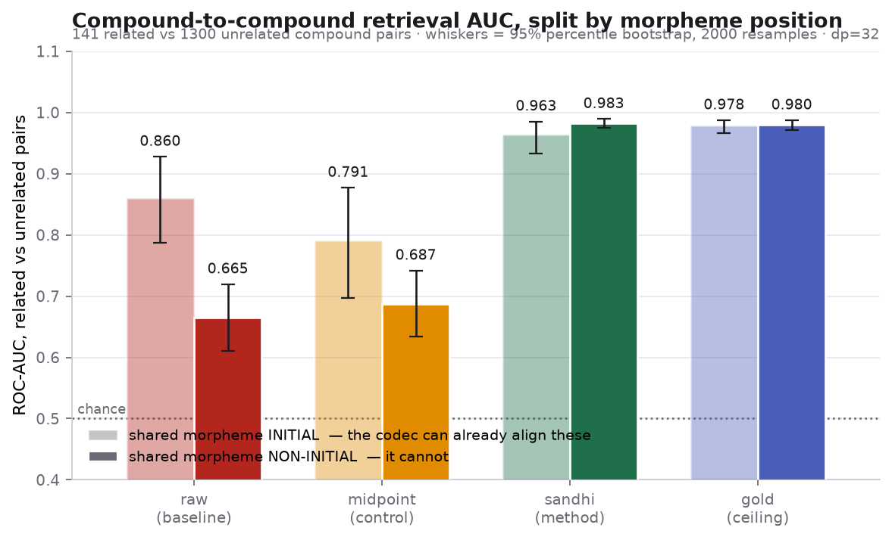

# ERA V5 — assignments

Coursework for **ERA V5 (The School of AI)**. Each session is a self-contained folder with
its own README, its own runnable code, and its own generated results.

| session | what it is |
|---|---|
| [**session-8-assignment**](session-8-assignment/) | **How attention learned to pay less** — every attention mechanism from Session 8 (18 required + FlashAttention), on an interactive timeline in the order they actually shipped, each with a verified date, source, and an honest pros/cons/pick-it-when. |
| [session-7-assignment](session-7-assignment/) | **Morphological segmentation as a training-free prior for the Kronecker byte–position codec.** Four conditions (baseline / method / control / ceiling), bootstrap CIs, a dp sweep, 40 tests, six plots. No training. |
| [session-6-assignment](session-6-assignment/) | TDES — a Training Data Execution System: shards → mixture → packing → training → ledgers → crash → resume → replay → fork → audit, with hash-chained provenance and 80 tests. |
| [session-4-assignment](session-4-assignment/) | Corpus cleaning: strategy inventory, a 10–100M-token dataset run through the pipeline, and a widget reporting what was removed and why. |
| [session-3-assignment](session-3-assignment/) | Data / eval / tokenizer strategy for a 40B India-first model. |
| [session-2-assignments-resubmitted](session-2-assignments-resubmitted/) | 10k-vocab multilingual BPE tokenizer (Hindi / Maithili / Sanskrit / English), evaluated on the faithful-Markdown metric. |
| [session-1-assignments](session-1-assignments/) | Neural network fundamentals. |

Every session runs from its own folder with one command; see the README inside each.

## Session 8 at a glance

Open **[session-8-assignment/index.html](session-8-assignment/index.html)** — a single self-contained page, no
build step. Nineteen mechanisms (18 the instructor covered, plus FlashAttention, found and dated separately),
laid out chronologically rather than grouped by family, each with a verified launch date, an honest pros/cons,
and a "pick it when" verdict. Full citation table and the "what the timeline shows" write-up:
**[session-8-assignment/README.md](session-8-assignment/README.md)**.

## Session 7 at a glance

Run it:

```bash
cd session-7-assignment
pip install -r requirements.txt
python run_experiment.py       # ~50s -> results.json, report/index.html, plots/*.png
python -m pytest tests -q      # 40 tests
```

The finding, in one figure — splitting a compound at **morpheme** boundaries recovers the
alignment the codec loses on non-initial morphemes, while a midpoint split that gets the
identical truncation relief recovers nothing:



Full write-up, method, controls and limitations: **[session-7-assignment/README.md](session-7-assignment/README.md)**.
